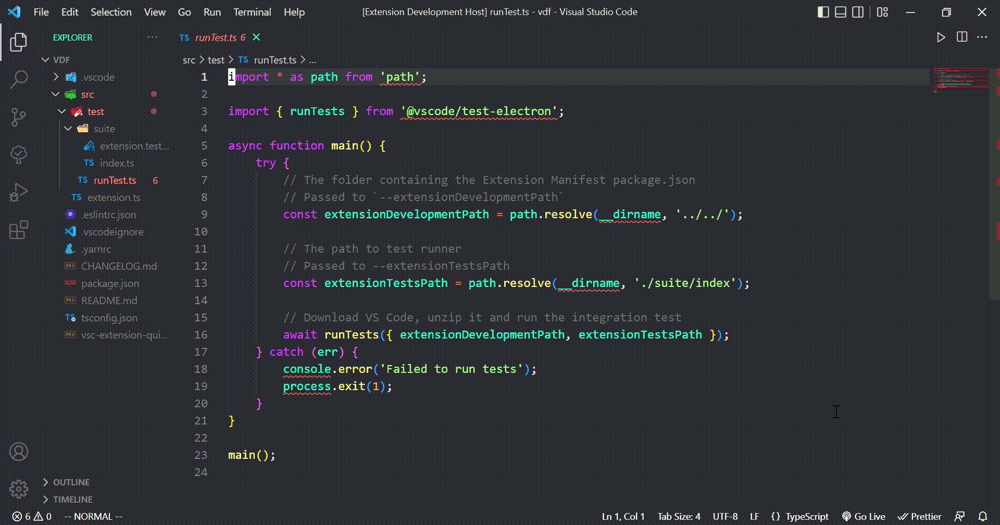

# vimlearn README

<!-- vscode marketplace link -->

VimLearn is a vscode extention that gives cheatsheet about vim with split view to active window.

## Demo

## Running VimLearn

- Run `npm install` in terminal to install dependencies
- press `F5` target in the Debug View. This will:
  - Start a task `npm: watch` to compile the code
  - Run the extension in a new VS Code window
